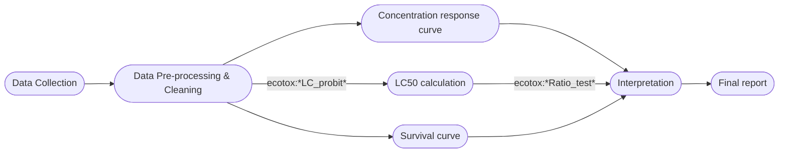

# Toxicological Effects of Alcohol‑Based and Non‑Alcohol‑Based Hand Sanitisers on *Daphnia pulex*
*A laboratory ecotoxicology study using acute/chronic toxicity tests, survival analysis, and physiological endpoints.*

---

## 📌 Project Overview

This repository aims to detail the results and analysis methodology of my bachelor’s thesis project, which investigated the toxicological effects of **alcohol-based (ABHS)** and **non‑alcohol‑based hand sanitisers (NABHS)** on *Daphnia pulex*, a key freshwater indicator species.

Reason for the study project: With increased sanitizer use during and after the COVID‑19 pandemic, large amounts of these chemicals now enter freshwater systems. Despite this, little is known about their potential environmental impacts.  
This project provides laboratory-based toxicological benchmarks and identifies methodological challenges such as **alcohol evaporation**, which can distort exposure concentrations in ecotoxicology studies.

---

## 🎯 Research Questions

- What are the **acute (short‑term)** and **chronic (long‑term)** toxic effects of alcohol- and non-alcohol based hand sanitizers on *Daphnia pulex*?
- What LC10, LC50, and MATC benchmarks can be established?
- How do sanitizer types compare in overall toxicity?
- Are there measurable physiological effects such as **heart rate reduction**?
- What methodological factors influence toxicity outcomes for volatile substances like alcohol?

---

## Data Analysis Workflow

---

## 🧪 Methods Summary

### Tests Conducted
- Acute toxicity tests (48-hour exposure)
- Chronic toxicity tests (14-day exposure)
- Heart rate comparison analysis before and after exposure   

### Tools & Software
- Excel (Data management)
- **RStudio (v4.0.5)**
- Key R packages:
  - `ecotox` – LC_probit function for Median Lethal Concentration value calculation (LC10 & LC50)
  - `survival` – Kaplan–Meier analysis (Survival curves graphs)
  - `stats` – paired t‑tests, ANOVA, Kruskal–Wallis  

### Toxicity Metrics
- **LC10 / LC50** values determined via probit regression  
- **MATC (Maximum Acceptable Toxicant Concentration)**  
- Comparative analysis of LC values using Ratio Tests  

### Heart Rate Analysis
- Paired t‑tests (before/after exposure)
- ANOVA or Kruskal–Wallis (between concentration groups)
- Inter‑group comparison of ABHS vs NABHS effects

---

## 📊 Data Analysis Workflow

1. Import and clean experimental datasets  
2. Conduct probit modelling for LC estimation  
3. Run survival analysis for chronic test groups  
4. Perform statistical significance tests for heart rate data  
5. Generate plots and visualisations  
6. Investigate inconsistent or non‑monotonic concentration–response results  

---

## 📈 Summary of Key Findings

*(Replace with your final findings once you add results.)*

- Alcohol evaporation significantly interfered with stable exposure concentrations.
- Several chronic toxicity trials produced inconsistent LC50 ordering; methodological artefacts were identified and analysed.
- NABHS showed clearer dose–response relationships than ABHS.
- Heart rate effects were statistically significant at several concentrations.

Detailed results can be found in the `/results` folder.

---
